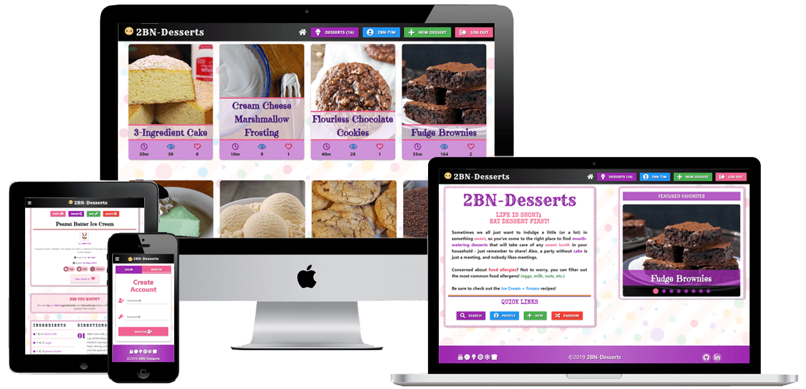
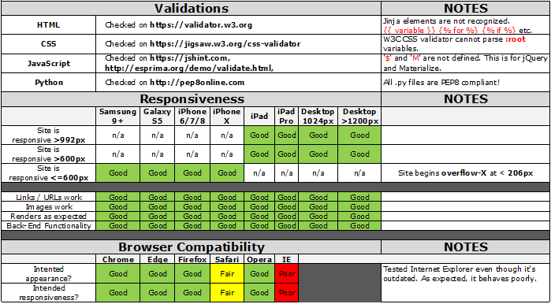

# [2BN-Desserts](https://tim-ms4.2bn.dev)



Looking for something sweet? You've come to the right place! [2BN-Desserts](https://tim-ms4.2bn.dev) is a place to find tasty recipes that will satisfy any sweet tooth. Do you have recipes that you'd like to share as well? Great news! You can create your own free account and add an unlimited number of delicious desserts to share with the world! If you like some of the recipes that other's have submitted, you can save them to your favorites for easier access later. You can even print and share recipes directly from the site!

---

## Table of Contents
1. [**UX**](#ux)
    - [**User Stories**](#user-stories)
    - [**Design**](#design)
        - [**Framework**](#framework)
        - [**Color Scheme**](#color-scheme)
        - [**Icons**](#icons)
        - [**Typography**](#typography)
    - [**Wireframes**](#wireframes)

2. [**Features**](#features)
    - [**Existing Features**](#existing-features)
    - [**Features Left to Implement**](#features-left-to-implement)

3. [**Technologies Used**](#technologies-used)
    - [**Front-End Technologies**](#front-end-technologies)
    - [**Back-End Technologies**](#back-end-technologies)

4. [**Testing**](#testing)
    - [**Validators**](#validators)
    - [**Compatibility**](#compatibility)
    - [**Known Issues**](#known-issues)

5. [**Deployment**](#deployment)
    - [**Local Deployment**](#local-deployment)
    - [**Remote Deployment**](#remote-deployment)

6. [**Credits**](#credits)
    - [**Content**](#content)
    - [**Media**](#media)
    - [**Code**](#code)
    - [**Acknowledgements**](#acknowledgements)

---

## UX

This project is part of my [Code Institute](https://codeinstitute.net/) Full Stack Software Development studies, specifically the **Data Centric Development** module. The objective for this milestone project is to "*Create a web application that allows users to store and easily access cooking recipes*", using the **CRUD** operations of **C**reate, **R**ead, **U**pdate, and **D**elete for their recipes.

I have decided to build a desserts-only project, since I personally bake quite regularly, and several of my own recipes are compiled in different places (kitchen cabinet, saved online, printed and shoved in a drawer, etc.). This was the perfect opportunity to finally have a single application to contain all of my own recipes in one source. A lot of people often ask me for specific recipes, so now I can quickly provide a single source for all of my recipes that can easily be shared or printed. It also allows others to store their own recipes securely.

### User Stories

"**_As a user, I would like to_** _____________________________"

:white_check_mark: *denotes items that have been successfully implemented*

- :white_check_mark: *view the site* from **any device** *(mobile, tablet, desktop)*.
- :white_check_mark: *view all recipes* as a **Guest**.
- :white_check_mark: *filter recipes* by **dessert type**.
- :white_check_mark: *filter recipes* by **allergen**.
- :white_check_mark: *sort/order recipes* by **author, favorites, last updated, recipe name, total time, and views**.
- :white_check_mark: **limit** the number of *recipes* to display, or see *all recipes*.
- :white_check_mark: *create* my **own profile**.
- :white_check_mark: *add* my **own recipes**.
- :white_check_mark: *edit* my **own recipes**.
- :white_check_mark: *delete* my **own recipes**.
- :white_check_mark: be able to **log out**.
- :white_check_mark: be able to **change my password**.
- :white_check_mark: be able to **delete my account**.
- :white_check_mark: *save recipes* in **my favorites**.
- :white_check_mark: *remove recipes* from **my favorites**.
- :white_check_mark: *see instructions* on how to **add a recipe**.
- :white_check_mark: **print** a *particular recipe*.
- :white_check_mark: **share** a *particular recipe*.
- :white_check_mark: *see* **recommended recipes** after *viewing a recipe*.
- :white_check_mark: *see* the **total views** of *a recipe*.
- :white_check_mark: *see* how many people **like** my *recipes*.
- :white_check_mark: *see* a cooking/baking **conversion table**.

### Design

When it comes to dessert, I think of *sweet* and *sugary* treats, so this is why I have designed my project using an overall *cute* and *sweet* concept, with cheerful avatars and bright colors.

#### Framework

- [Materialize 1.0.0](https://materializecss.com/)
    - I really like the modern and clean layout of Materialize as a framework, with its simple-to-understand documentation.
- [jQuery 3.4.0](https://code.jquery.com/jquery/)
    - In an effort to keep the JavaScript minimal, I have decided to use jQuery as foundation to my scripts framework.
- [Flask 1.0.2](http://flask.pocoo.org/)
    - Flask is a microframework that I've used to render the back-end Python with the front-end Materialize.

#### Color Scheme

In keeping with the overall *sweet* theme, I have opted for a bright and colorful color scheme. These standard [Materialize Colors](https://materializecss.com/color.html) work quite well for my project.

-  `#9C27B0` (**purple** - *primary color*)
-  `#F06292` (**pink lighten-2** - *secondary color*)
-  `#2196F3` (**blue** - *tertiary color*)
-  `#4CAF50` (**green** - *quaternary color*)

#### Icons

- [Materialize Icons](https://materializecss.com/icons.html)
    - I've retained only a select few of the standard Materialize Icons, as these are built-in to some of their components. However, on mobile devices, clicking buttons like 'close' **X**, the browser thinks you're wanting to perform a search for that text, so I have replaced some of them with Font Awesome icons.
- [Font Awesome 5.8.1](https://fontawesome.com/)
    - Although Materialize Icons have nearly 1,000 free-to-use icons, I prefer the look of Font Awesome's icons, and they have more to suit my specific needs for this project. They aren't displayed using *text*, but rather *classes*, so use on mobile devices isn't affected.

#### Typography

- I have incorporated a number of [Google Fonts](https://fonts.google.com/) throughout the entire application. The font I have selected for all recipe names is called [Emilys Candy](https://fonts.google.com/specimen/Emilys+Candy), because it fits perfectly into the overall *cute* and *sweet* theme. Aside from the built-in Materialize fonts, I have imported these Google Fonts:
    - [Abril Fatface](https://fonts.google.com/specimen/Abril+Fatface)
    - [Amatic SC](https://fonts.google.com/specimen/Amatic+SC)
    - [Cabin Sketch](https://fonts.google.com/specimen/Cabin+Sketch)
    - [Emilys Candy](https://fonts.google.com/specimen/Emilys+Candy)
    - [Fredericka the Great](https://fonts.google.com/specimen/Fredericka+the+Great)
    - [Merienda One](https://fonts.google.com/specimen/Merienda+One)
    - [Rye](https://fonts.google.com/specimen/Rye)
    - [Special Elite](https://fonts.google.com/specimen/Special+Elite)

### Wireframes

For my wireframes, I have used [Balsamiq Wireframes](https://balsamiq.com/) for a couple reasons:
- Code Institute have provided all students with free access until the end of ~~2019~~ 2020.
- The simplicity and ease of use. I actually found Balsamiq much easier and quicker to use than my former preferred wireframe program, Adobe XD.

All of my wireframes for this project can be found [here](app/wireframes/) in the *wireframes* sub-directory.

##### back to [top](#table-of-contents)

---

## Features

I've added a few extra features to my project that weren't part of the requirements, because I felt they made the project 'complete' for better user interaction.

### Existing Features

**Register Account**
- Anybody can register for free and create their own unique account. I have built-in authentication and authorization to check certain criteria is met before an account is validated. All passwords are hashed for security purposes!

**Log In to Account**
- For existing users, I have more authentication and authorization incorporated to check that the hashed passwords and username match the database.

**Change Password**
- Users can update their passwords from their profile page, after first validating their existing password.

**Log Out of Account**
- Users can easily log out of their account with the click of a button.

**Delete Account**
- Users can delete their entire account, but a warning is provided to first validate their password, and advise that all of their own recipes will also be deleted, and their favorites removed.

**View All Desserts**
- On the *desserts* page, all recipes are initially displayed in an alphabetical order, with a standard 12-items per page using pagination.

**Search Desserts**
- If a user would like to search for something specific, whether it's a particular recipe, a certain dessert category, or for recipes that exclude certain allergens, then the Search button is perfect! There's also an option to sort the results by a number of different options, order them by either ascending or descending, and even limit the number of results that are displayed per page.

**Add a Recipe**
- [**C**RUD] Create or 'add' a new recipe. Defensive programming in place means users must adhere to minimal requirements when adding a new recipe. If a user doesn't have a photo to accompany their recipe, I have a built-in function that will automatically assign a cute placeholder image based on the type of dessert category they've selected.

**View a Recipe**
- [C**R**UD] Read or 'review' recipes, either from the main page, or the user profile. From here, users also have additional options:
    - Print the recipe.
    - Share the recipe.
    - Check ingredients / directions as 'complete' if making the recipe themselves.
    - View two additional recipe suggestions.
    - View a *conversion chart* either by temperature, volume, or weight.

**Update a Recipe**
- [CR**U**D] Update or 'edit' their own user recipes on this page.

**Delete a Recipe**
- [CRU**D**] Delete or 'remove' a user's own recipes. The *admin* account also has access to delete recipes, should they be inappropriate for example.

**Save a Recipe to Favorites**
- Users can save their own recipes, or recipes submitted by other users, directly into their profile for quicker access next time.

**Remove a Recipe from Favorites**
- If a user no longer likes a recipe, or simply wants to remove it from their favorites, a single click can remove a recipe.

**Admin Superuser**
- My ***'Admin'*** profile has several extra features, which currently include:
    - Edit / Delete any recipe from the database.
    - View join-date / favs / recipes of all registered users. (added February 2020)
    - Delete any registered user from the database. (added February 2020)
    - Receive email for new recipes added or edited from database as backup in case database is lost. (added March 2020)
    - View an interactive map of all visitors to the site. (added April 2020)
    - View statistics of unique visitors by country, and total count. (added April 2020)

### Features Left to Implement

In an ideal world, there are a couple items that I would've loved to have completed as well, but just didn't have the time or knowledge just yet as to how to implement these features.

**Pagination Truncation** (added: 07APR2020)
- ~~I have core functionality to properly paginate, but should my database start to expand with several dozen more recipes, then the current pagination will display every page number that exists. If pagination gets too long, ideally it should truncate the middle section of page numbers, so that only the first and last page numbers are displayed, leaving the center section as an ellipse (...) to not clog up too much space on the page.~~
- **07APR2020**: The ellipse method wasn't showing the current page in view, so now I have pagination showing the current page number +/-2 pages on either end. You can now also go to *First* and *Last* page, instead of each page number one at a time.

**Add / Delete individual Ingredients / Directions** (added: 04APR2020)
- ~~Currently, I have a single add / delete button for the Ingredients and Directions sections of the recipe. Once a user clicks to add a new ingredient for example, then the previous line is cloned just below that. The same functionality for directions is in place. However, if a user needs to delete something, it will only delete the absolute last item in the list. This means that if the user needs to delete ingredient #2 for example, they cannot currently delete that line independently without going through all other items in the list that come after it. Eventually I would like to append an add / delete button for each item that's generated.~~
- **04APR2020**: This capability is added now, so users can add/remove individual ingredients or directions chosen, not necessarily the last one from the list only.

##### back to [top](#table-of-contents)

---

## Technologies Used

- [VS Code](https://code.visualstudio.com/) - Used as my primary IDE for coding.
- [GitHub](https://github.com/) - Used as remote storage of my code online.
- [Photoshop CS6](https://www.adobe.com/Photoshop) - Used for editing images.
- [TinyPNG](https://tinypng.com/) - Used to compress images for faster loading.

### Front-End Technologies

- [HTML](https://developer.mozilla.org/en-US/docs/Web/Guide/HTML/HTML5) - Used as the base for markup text.
- [CSS](https://developer.mozilla.org/en-US/docs/Web/CSS/CSS3) - Used as the base for cascading styles.
- [jQuery 3.4.0](https://code.jquery.com/jquery/) - Used as the primary JavaScript functionality.
- [Materialize 1.0.0](https://materializecss.com/) - Used as the overall design framework.
- [LeafletJS](https://leafletjs.com/): Used for Admin visitor tracking purposes.


### Back-End Technologies

- **Flask**
    - [Flask 1.0.2](http://flask.pocoo.org/) - Used as a microframework.
    - [Flask Blueprints](http://flask.pocoo.org/docs/1.0/blueprints/) - Used to split the python code for routes.
    - [Flask Talisman](https://github.com/GoogleCloudPlatform/flask-talisman) - Used for security headers (HTTPS vs HTTP).
    - [Jinja 2.10](http://jinja.pocoo.org/docs/2.10/) - Used for templating with Flask.
    - [Werkzeug 0.16](https://werkzeug.palletsprojects.com/en/0.16.x/) - Used for password hashing, authentication, and authorization.
- **Heroku**
    - [Heroku](https://www.heroku.com) - Used for app hosting.
- **Python**    
    - [Python 3.6.7](https://www.python.org/) - Used as the back-end programming language.
    - [MongoDB Atlas](https://www.mongodb.com/) - Used to store my database in the 'cloud'.
    - [PyMongo 3.8.0](https://api.mongodb.com/python/current/) - Used as the Python API for MongoDB.
    - [Python Slugify 3.0.2](https://pypi.org/project/python-slugify/) - Used to generate user-friendly URLs.
    - [Python dotenv](https://github.com/theskumar/python-dotenv) - Used to get/set values in `.env` file.

##### back to [top](#table-of-contents)

---

## Testing

**Creating an Account**

I've created my own personal account, along with the master *Admin* account. In addition to these two primary accounts, I've tested with about 20 fake accounts in order to confirm authentication and validation worked as expected.

**Add | Edit | Delete a Recipe**

In addition to my personal recipes, I've created about 50 test recipes, mostly *Aaaaa*, *Bbbbb*, *Ccccc* in order to prepare for pagination building. These recipes were created using my actual account, the admin account, and several test accounts.

For several recipes, I've edited minor things like the recipe description, adding additional ingredients or directions, to test the functionality of updating a recipe to the database.

After successfully implementing pagination, I've deleted all of my test recipes. To properly test the admin functionality, I didn't delete all of the recipes as the test-user; several were deleted by the admin account.

**Pagination**

When implementing pagination, I had a lot of manual tests to undergo, in order to make pagination work for multiple scenarios. I needed to test that all aspects of pagination worked with and without the option for searching the database. These included:

- **Pagination without Search**
    - Pagination works if no URL args present on initial load.
    - *Previous Page* button disabled on first page of all recipes shown.
    - *Next Page* button disabled on last page of all recipes shown.
    - Appropriate number of pages appear based on the initial 12 items per page with correct number of recipes in database.
    - Additional page numbers appear if more recipes are added.
    - Each page number returns their correct page URL.

- **Pagination with Search**
    - Pagination works if no URL args present on initial search.
    - No pagination shown if 0 search results.
    - No pagination shown if only 1 page of search results.
    - No pagination shown if fewer results than user-selected items per page.
    - No pagination shown if user selects *All* results to be displayed.
    - *Previous Page* button disabled on first page of multi-page search results.
    - *Next Page* button disabled on last page of multi-page search results.
    - Appropriate number of pages appear based on user-selected items per page.
    - Additional page numbers appear if more recipes are added.
    - Each page number returns their correct page URL.

**Sort, Order, and Limit**

With the Search function, the user has the option to sort, order, and limit the number of results. This required some manual testing as well.

- **Sorting + Ordering**
    - Sorting by *Author* or *Recipe Name* works accordingly:
        - ascending (alphabetical A-Z)
        - descending (alphabetical Z-A)
    - Sorting by *Favorites* or *Views* works accordingly:
        - ascending (lowest to highest)
        - descending (highest to lowest)
    - Sorting by *Last Edited* works accordingly:
        - ascending (oldest to newest)
        - descending (newest to oldest)
    - Sorting by *Total Time* works accordingly:
        - ascending (shortest to longest)
        - descending (longest to shortest)

- **Limiting**
    - Limit results by 8 | 12 | 16 | 20 recipes per page:
        - Depending on number of results found, correct pagination for user-selected number of items to display.
    - Show *All* results on single page:
        - No matter how many results are found, if user selects *All*, it will show all results on a single page without Pagination.

**Profile**

As a **standard user**, there are four profile buttons.

- *View your own submitted recipes*:
    - If a user hasn't submitted anything yet, a cute quote is displayed to encourage the user to submit their own. As aforementioned, I've created and deleted several recipes to test this functionality works when logged in as any user.
- *View recipes you've saved*:
    - This can be the user's own recipes, or recipes submitted by other users. Again, if the user hasn't yet saved anything to their favorites, then a cute quote is displayed to encourage them to check out some of the delicious desserts that others have already submitted. I have saved and removed dozens of recipes in my test accounts and my live accounts in order to test this functionality works perfectly.
- *Change your password*:
    - Users can change their password, but will first need to validate their current password for authentication. Along with my test accounts, I constantly changed the passwords to ensure everything was successful.
- *Delete account*:
    - Users can delete their account entirely, and will need to confirm deletion by inputting their password for verification. A prompt is shown to warn the user that their submitted recipes and anything they've saved will also be removed permanently. When I was done testing with my test accounts, I deleted them using this function without any problems. Some of these were deleted using my admin account though, since admin can delete recipes and/or users where applicable.

As the **Admin**, the first three buttons are identical to a standard user. The fourth button however, is purely for the admin profile, which can delete users if required. Some of the test accounts that I had were deleted by the admin account to test this functionality. It will find all recipes that the user submitted and remove them, pull any 'likes' on those recipes, find all recipes that the user saved and decrement their 'likes' by -1, and finally remove the user entirely from the database.

**Printing a Recipe**

Some people like to print things still, especially recipes that they may want to save in their kitchen cabinet (I speak from person experience as a baker). There's a lot of fluff built into the page that is purely for visual purposes, not needed for a printed recipe, which just wastes ink and paper. I tested numerous recipes and the print function, to ensure everything was being stripped out completely except the important things: **a)** the recipe title, **b)** the ingredients list, and **c)** the directions required.

**Share a Recipe**

I wanted to incorporate a way to share the recipe, without having any social media imbedded links, so *Copy to Clipboard* was implemented. This was tested on a lot of the recipes. Eventually I 'broke' the code by refactoring some elements later in the development stage, but due to the numerous testing I did after each commit, it was quickly found and fixed.


### Validators

**HTML**
- [W3C HTML Validator](https://validator.w3.org) - Unfortunately the W3C Validator for HTML does not understand the Jinja templating syntax, so it therefore shows a lot of errors with regards to `{{ variables }}`, ` `, etc. Aside from the Jinja warnings and errors, all of the remaining code is perfectly validating. Also due to the Jinja templating, certain elements cannot be 'beautified' across multiple lines, and must remain on a single line. An example of this is the `<select>` element, which is rather long with specific Materialize classes, and Jinja templating.

**CSS**
- [W3C CSS Validator](https://jigsaw.w3.org/css-validator/) - I am using `:root{}` variables in my CSS, which isn't [yet?] recognized by the validator. This is causing several **Parsing Errors**, when in fact they are not errors, and work perfectly fine.
- **Parse Error** *[ li)]* - for some reason, the validator does not recognize the `<li>` element in my `:not(#search_form li)` code, but everything else breaks that particular code, so I've left it alone.

```css
.collapsible-collection li:nth-child(odd):not(#search_form li) {
    background-color: rgba(var(--purpleLight5), 0.75);
}
.collapsible-collection li:nth-child(even):not(#search_form li) {
    background-color: rgba(var(--pinkLight5), 0.75);
}
```

- **Same color for background-color and border-bottom-color** - The code below overrides the Materialize color for the checkbox animation effect, so the validator thinks this is an error, but is correct in order to override the color with my own.

```css
[type="radio"].with-gap:checked + span:after
[type="radio"]:checked + span:after
```

**JavaScript**
- [JShint](https://jshint.com/)
    - "There are **37** functions in this file.
    Function with the largest signature take **0** arguments, while the median is **0**.
    Largest function has **41** statements in it, while the median is **1**.
    The most complex function has a cyclomatic complexity value of **10** while the median is **2**."
    Two undefined variables:
        - `$` (141 times - this is for jQuery)
        - `M` (4 times - this is for Materialize)
- [JSesprima](http://esprima.org/demo/validate.html)
    - "Code is syntactically valid."
- [Beautify Tools](http://beautifytools.com/javascript-validator.php)
    - `M` is not defined. (4 times - for Materialize)

**Python**
- [PEP8 Online](http://pep8online.com/)
    - All `.py` files are completely PEP8 compliant!

### Compatibility

To ensure a broad range of users can successfully use this site, I tested it across the 6 major browsers in both desktop and mobile configuration.

- Chrome *v.74*
- Edge *v.18*
- Firefox *v.67*
- Safari *v.12*
- Opera *v.56*
- Internet Explorer *v.11*

For testing compatibility, I created a testing matrix to test across multiple devices and browsers. The test matrix can be found [here](app/testing/test-matrix.png). A brief overview:



### Known Issues

During development, I discovered two issues after committing to GitHub. For both of these bugs, I opened and *issue* on GitHub so I could come back and properly fix them.

- **[Flaw when updating a recipe to database](https://github.com/TravelTimN/ci-milestone04-dcd/issues/1)**
    - Found the bug, refactored my code, and pushed.
- **[404 + 500 error handlers (fault)](https://github.com/TravelTimN/ci-milestone04-dcd/issues/8)**
    - Helpful recommendation from my mentor to read about *Flask Blueprints + Error-Handlers*. Eventually I had to create a catch-all generic error handler.

##### back to [top](#table-of-contents)

---

## Deployment

### Local Deployment

Please note - in order to run this project locally on your own system, you will need the following installed:
- [Python3](https://www.python.org/downloads) to run the application.
- [PIP](https://pip.pypa.io/en/stable/installing) to install all app requirements.
- Any IDE such as [Microsoft Visual Studio Code](https://code.visualstudio.com).
- [GIT](https://www.atlassian.com/git/tutorials/install-git) for cloning and version control.
- [MongoDB](https://www.mongodb.com) to develop your own database either locally or remotely on MongoDB Atlas.

Next, there's a series of steps to take in order to proceed with local deployment:

- Clone this GitHub repository by either clicking the green *Clone or download* button and downloading the project as a zip-file (remember to unzip it first), or by entering the following into the Git CLI terminal:
    - `git clone https://github.com/TravelTimN/ci-milestone04-dcd.git`.
- Navigate to the correct file location after unpacking the files.
    - `cd <path to folder>`
- Create a `.env` file with your credentials. An example can be found [here](.env_sample). Be sure to include your *MONGO_URI* and *SECRET_KEY* values.
- Create a `.flaskenv` file and add the following entries:
    - `FLASK_APP=run.py`
    - `FLASK_ENV=development`
- Install all requirements from the [requirements.txt](requirements.txt) file using this command:
    - `sudo -H pip3 -r requirements.txt`
- Sign up for a free account on [MongoDB](https://www.mongodb.com) and create a new Database called **2BN-Desserts**. The *Collections* in that database should be as follows:

**ALLERGENS**
```
_id: <ObjectId>
allergen_name: <array>
```

**DESSERTS**
```
_id: <ObjectId>
dessert_type: <array>
```

**MEASUREMENTS**
```
_id: <ObjectId>
measurement_unit: <array>
```

**RECIPES**
```
_id: <ObjectId>
recipe_name: <string>
recipe_slug: <string>
description: <string>
dessert_type: <string>
ingredient_amount: <array>
ingredient_measurement: <array>
ingredient_name: <array>
directions: <array>
total_hrs: <string>
total_mins: <string>
total_time: <int32>
allergens: <array>
img_src: <string>
author: <ObjectId>
date_added: <string>
date_updated: <string>
last_edit: <int32>
views: <int32>
user_favs: <int32>
```

**USERS**
```
_id: <ObjectId>
username: <string>
username_lower: <string>
user_password: <string>
user_avatar: <string>
user_recipes: <array>
user_favs: <array>
```

- You should now be able to launch your app using the following command in your terminal:
    - `flask run`
- The app should now be running on *localhost* on an address similar to `http://127.0.0.1:5000`. Simply copy/paste this into the browser of your choice!

### Remote Deployment

This site is currently deployed on [Heroku](https://www.heroku.com/) using the **main** branch on GitHub. To implement this project on Heroku, the following steps were taken:

1. Create a **requirements.txt** file so Heroku can install the required dependencies to run the app.
    - `sudo pip3 freeze --local > requirements.txt`
    - My file can be found [here](requirements.txt).
2. Create a **Procfile** to tell Heroku what type of application is being deployed, and how to run it.
    - `echo web: python run.py > Procfile`
    - My file can be found [here](Procfile).
3. Sign up for a free Heroku account, create your project app, and click the **Deploy** tab, at which point you can *Connect GitHub* as the Deployment Method, and select *Enable Automatic Deployment*.
4. In the Heroku **Settings** tab, click on the *Reveal Config Vars* button to configure environmental variables as follows:
    - **IP** : `0.0.0.0`
    - **PORT** : `8080`
    - **MONGO_URI** : `<link to your Mongo DB>`
    - **SECRET_KEY** : `<your own secret key>`
    - **MY_ADDRESS** : `<your own email address>`
    - **SEND_TO** : `<recipient email address>`
    - **PASSWORD** : `<you own email password>`
5. Your app should be successfully deployed to Heroku at this point. :tada:

**NOTE** : You might receive errors sending emails if you have your Google Account setup with **2-Factor Authentication**, **Less Secure Apps** disabled, or **DisplayUnlockCaptcha** disabled.

**Plausible Fix** *(which has worked for me)*
- Turn Off [2-Factor Authentication](https://myaccount.google.com/signinoptions/two-step-verification/enroll-welcome)
- Turn On [Less Secure Apps](https://myaccount.google.com/lesssecureapps)
- Turn On [DisplayUnlockCaptcha](https://accounts.google.com/DisplayUnlockCaptcha)

I would recommend to create a secondary Google account for this purpose, instead of using your actual account (keep your actual account secure!). This is purely used for sending emails as a backup when new recipes are created or updated, in case the database somehow accidentally has an item deleted.


##### back to [top](#table-of-contents)

---

## Credits

### Content

- [*"How to Write a Git Commit Message"*](https://chris.beams.io/posts/git-commit/) by **Chris Beams** (*as recommended by Code Institute assessors on previous projects*)
- Converting **Cups** to **Grams** : [ErrensKitchen](https://www.errenskitchen.com/cooking-conversions/cups-to-grams-and-oz/)

### Media

Sources of the images used on this site:

- **favicon** : [Clipart-Library](http://clipart-library.com/kawaii-cookie-cliparts.html)
- **recipe placeholder image** : [Pixabay](https://pixabay.com/photos/waffles-waffles-bake-ingredients-2190961/)
- **profile avatars** : [123rf](https://www.123rf.com/photo_40610865_stock-vector-cute-kawaii-dessert-cake-macaroon-ice-cream-icons.html)
- **background image** : [vecteezy](https://www.vecteezy.com/vector-art/113872-polka-dots-vector-pattern)
- **error 404 | 500 images** :
    - [freepik - 0](https://www.freepik.com/free-vector/kawaii-food-collection_4237785.htm)
    - [freepik - 4](https://www.freepik.com/premium-vector/number-four-kawaii-comic-character_2632836.htm)
    - [freepik - 5](https://www.freepik.com/premium-vector/number-five-kawaii-comic-character_2632838.htm)
- **mockup image in README** : [techsini](https://techsini.com/multi-mockup/)

### Code

- Suggested **.gitignore** files from [GitHub/gitignore](https://github.com/github/gitignore)
- **Custom Toast** on *page load* (instead of **Materialize Toasts** with an *onclick* event) for my Flask Flash Messages : [StackOverflow](https://stackoverflow.com/questions/43345678/how-to-display-the-snack-bar-on-page-load)
- **Custom list item** attributes (instead of standard bullet points) for my recipe *Directions* : [CSS Tricks](https://css-tricks.com/custom-list-number-styling/)
- **Auto-Open '.card-reveal'** on *:hover* : [StackOverflow](https://stackoverflow.com/questions/36290110/open-card-reveal-content-by-hover-the-activator-in-materializecss)
- **Print** only certain elements : [StackOverflow](https://stackoverflow.com/a/2618980)
- **Copy to Clipboard** : [w3schools](https://www.w3schools.com/howto/howto_js_copy_clipboard.asp)
- **Enforce Validation on Materialize Dropdowns** : [StackOverflow](https://stackoverflow.com/questions/34248898/how-to-validate-select-option-for-a-materialize-dropdown)
- **Flask Blueprints walkthrough** : [Corey Schafer on YouTube](https://youtu.be/Wfx4YBzg16s)
- **Sending Emails using Python** :
    - [freeCodeCamp](https://www.freecodecamp.org/news/send-emails-using-code-4fcea9df63f/)
    - [StackOverflow](https://stackoverflow.com/a/17596848)
    - [StackOverflow](https://stackoverflow.com/q/16512592)
    - [StackOverflow](https://stackoverflow.com/a/8519646)
- **Find Client IP Address** :
    - [StackOverflow](https://stackoverflow.com/a/35123097)
    - [IP API](https://ipapi.co/json/)
    - [IP Info](https://ipinfo.io/json)
- **Get Proper IP Address, not Heroku IP** : [StackOverflow](https://stackoverflow.com/a/37061471)

### Acknowledgements

- [Ignatius Ukwuoma](https://github.com/ignatiusukwuoma)
    - My Code Institute mentor.
- [Chris Quinn](https://github.com/10xOXR)
    - My accountability partner on all projects.
- [Sean Murphy](https://github.com/nazarja)
    - For helping me have a euphoric epiphany on how things work with the back-end.

##### back to [top](#table-of-contents)
